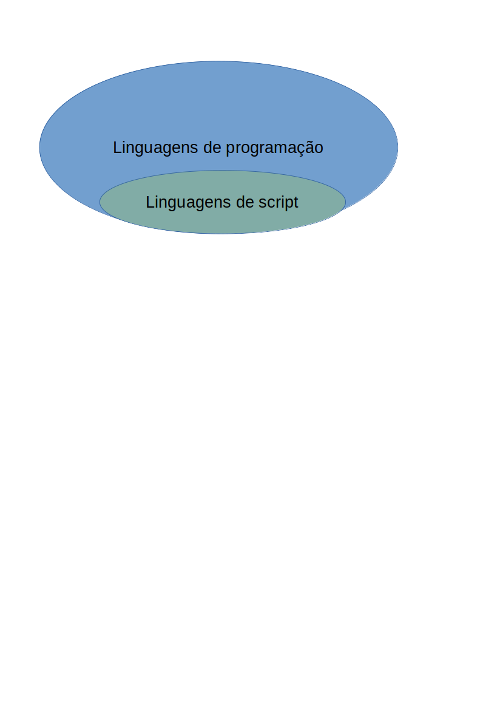

# Fundamentos de Internet

## Fundamentos de internet.
  Esta página tem como objetivo servir como fonte de referência para explicação de conceitos de tecnologias de internet em português brasileiro. Construída em 7/08/2020 e colocada on-line em 15/12/2020, ela pode sofrer modificações ou receber mais informações a partir desta data.

## Como os navegadores funcionam?
  Um navegador é uma aplicação de software utilizada para localizar, fornecer e apresentar conteúdo da World Wide Web, incluindo páginas Web, imagens, vídeos, entre outros arquivos. Como em um modelo cliente/servidor, o navegador é o cliente executado em um computador que contacta o servidor Web e requisita informações. O servidor web envia a informação de volta ao navegador Web na qual apresenta os resultados no computador ou em outro dispositivo conectado à rede que suporta o navegador. Os navegadores de hoje são conjunto de softwares totalmente funcionais que podem interpretar e apresentar páginas HTML, aplicações, executar código JavaScript, requisições AJAX entre outros conteúdos hospedados em servidores Web. Muitos navegadores oferecem plug-ins que podem estender as capacidades do software então assim eles podem apresentar informação multimídia (incluindo som e vídeo), ou o navegador pode ser usado para realizar tarefas como vídeo conferência, projetar páginas web ou filtros anti pishing além de outras características de segurança do navegador. Um navegador é um grupo de códigos estruturados na qual juntos realizam uma série de tarefas para mostrar uma página web na tela. De acordo com as tarefas que elas realizam, esses códigos são feitos de diferentes componentes, que são: a interface de usuário controlada pelo 'UI backend', a 'engine' do navegador que contém o mecanismo de persistência de dados (data persistence), a 'engine' de renderização composta pela rede (networking), o interpretador JavaScript e a UI Backend.
### Principais componentes de um navegador:
    
   1. A interface de usuário (UI): A interface de usuário é o espaço aonde o usuário interage com o navegador. Nela, estão incluídos a barra de endereço, os botões de voltar e avançar, página inicial, recarregar e parar, favoritar, etc. Qualquer outra parte, exceto a janela aonde a página requisitada é mostrada, vem sob ela.
   
   2. A 'engine' do navegador: A ‘engine’ do navegador trabalha como uma ponte entre a interface de usuário e a ‘engine’ de renderização. De acordo com os dados de entrada de várias interfaces de usuário, ela consulta e manipula a ‘engine’ de renderização.
   
   3. A 'engine' de renderização: A ‘engine’ de renderização, como o nome sugere, é responsável por renderizar a página web solicitada na tela do navegador. A ‘engine’ de renderização interpreta o código HTML, documentos XML e imagens que estão formatadas usando CSS e gera o layout que é mostrado na interface de usuário. Entretanto, utilizando plug-ins ou extensões, ela pode mostrar outros tipos de dados também. Diferentes navegadores utilizam diferentes ‘engines’ de renderização:
       
      * Microsoft Internet Explorer (descontinuado - 17/08/2021): Trident
      * Firefox e outros navegadores da Mozilla: Gecko 
      * Chrome & Opera 15+ & Microsoft Edge: Blink 
      * Chrome (iPhone) & Safari: WebKit
        onstruída em 
   4. Rede (Networking): Componente do navegador na qual fornece as URLs utilizando os protocolos comuns de internet: o HTTP ou o FTP. O componente de rede lida com todos os aspectos de comunicação e segurança da internet. O componente de rede pode implementar um cache ou documentos fornecidos com o intuito de reduzir o tráfego de rede.
   
   5. O interpretador JavaScript: Este é o componente na qual o navegador interpreta e executa o código JavaScript incorporado nas páginas web. Os resultados da interpretação são enviados para a ‘engine’ de renderização para serem mostrados. Análises são mantidas em segundo plano até que o script seja executado.
   
   6. Back end UI: O backend UI é usado para desenhar widgets básicos como combo boxes e janelas. Este backend expõe uma interface genérica que não é específica de uma plataforma. Ela sobrepõe métodos utilizados pela interface do sistema operacional. 
   
   7. Armazenamento/Persistência de dados: Esta é a camada de persistência. Navegadores fornecem mecanismos como armazenagem local, Banco de dados indexado (IndexedDB), WebSQL e sistema de arquivos. É um pequeno banco de dados criado no disco local do computador aonde o navegador esta instalado. Ele gerencia dados como cache, cookies, favoritos e preferências.
        
   Uma coisa importante de se notar é que em navegadores web como o Chrome, cada aba é executada em um processo separado (múltiplas instâncias da engine de renderização).
   
    
#### engine: motor; mecanismo; peça

### O motor de renderização
    
  A camada de rede iniciará enviando os conteúdos dos documentos requisitados para a engine de renderização em pacotes de 8KBs.
  
  O motor de renderização analisa pacotes do documento HTML e converte os elementos em nodos do DOM em uma árvore chamada “árvore de conteúdo” ou “árvore DOM”. Ela também analisa ambos os arquivos CSS como elementos de estilo 
  
 Enquanto a árvore DOM esta sendo construída, o navegador constrói outra árvore, a árvore de renderização. A árvore é feita de elementos visuais de acordo como eles aparecerão. É uma representação visual do documento. O propósito desta árvore é permitir desenhar os conteúdos na ordem correta. O Firefox chama os elementos na árvore de renderização de “frames” (quadros). WebKit utiliza o termo renderizável (renderer) ou objeto renderizável (reder object). 
 
  Depois da construção da árvore de renderização, ela irá passará por um “processo de layout” da árvore de renderização. Quando o renderizável é criado e adicionado à árvore, ele não tem posição e tamanho. O processo de cálculo desses valores é chamado de layout ou refluxo. Isso significa dar a cada nodo as coordenadas exatas aonde deveriam aparecer na tela. A posição da raiz do renderizável é 0,0 e suas dimensões são iguais à porta de vista (a parte visível da janela do navegador). Todos os renderizáveis tem um “layout” ou um método de “refluxo”, cada renderizável invoca um método de layout dos métodos criança que precisam de layout. 
  
  O próximo passo é desenhar. No estágio de desenho, a árvore de renderização é varrida e o método “paint()” do renderizável é chamado para mostrar o conteúdo na tela. O método de desenho utiliza a camada do UI back end. 
  
  O motor de renderização sempre tenta mostrar os conteúdos na tela assim que possível para melhorar a experiência de usuário. Ela não espera pela análise do HTML para se completar antes de começar a construir o layout e a árvore de renderização. Ela análise e mostra o conteúdo que recebeu da rede, enquanto o resto dos conteúdos ainda continuam chegando da rede. 
    
## O protocolo HTTP
 
### O que é o HTTP?
    
  O Protocolo de Transferência de Hiper Texto é um protocolo de aplicação para distribuição, colaboração entre sistemas de hipermídia que permite aos usuários comunicar dados na World Wide Web.
  
  HTTP significa Hyper Text Transfer Protocol Serve para a comunicação entre servidores web e clientes HTTP Request/Response, Loading pages, submit form, AJAX calls.
### O HTTP é 'stateless' (protocolo sem estado)
    
  O que é Stateless? Stateless significa que não existe nenhum registro de interações prévias e cada requisição de interação tem de ser lidada baseando se inteiramente na informação que vem junto. ‘Stateful’ e ‘Stateless’ são derivados da utilização de um estado como um conjunto de condições em algum momento do tempo. Cada requisição é completamente independente Similar às transações Programação, Armazenamento local, Cookies, Seções são usadas para criar experiências de usuários melhoradas.
    
### Qual o propósito do HTTP?

  O HTTP foi inventado junto com o HTML para criar o primeiro navegador interativo baseado em texto: a World Wide Web original. Hoje, o protocolo permanece como meio primário para se utilizar a internet.
### O que o HTTP pode fazer?

  O HTTP permite um conjunto de métodos de destinação aberta e cabeçalhos que indicam o propósito de uma requisição (request). Ela constrói sobre a disciplina de referência pela Uniform Resource Identifier (URI), assim como localização (URL), ou nome (URN), para indicar o recurso na qual um método pode ser aplicado.
  
  Mensagens são passadas em um formato similar ao utilizado pelo correio de Internet (Internet mail) assim definido pelo Multipurpose Internet Mail Extensions (MIME). O HTTP é também usado como um protocolo genérico para comunicação entre usuários agentes (user agents) e proxies/gateways para outros sistemas de internet, incluindo aqueles fornecidos por SMTP, NNTP, FTP, Gopher, e protocolos WAIS. Desta maneira, o HTTP permite acesso básico à hipermídias disponíveis de diversas aplicações.
### Como o HTTP funciona?
  
  Como um protocolo de requisição e resposta, o HTTP dá aos usuários uma maneira de interagir com recursos web tal como arquivos HTML ao transmitir mensagens de hipertexto entre clientes e servidores. O cliente HTTP geralmente usa as conexões Transmission Control Protocol (TCP) para se comunicar com os servidores.
  
  O HTTP utiliza métodos de requisição específico com o intuito de realizar várias tarefas: 

  - GET requisita um recurso específico em sua integridade.
  - HEAD requisita um recurso especifico sem um corpo de conteúdo. 
  - POST adiciona conteúdo, mensagens, ou dados para uma nova página sob um recurso web existente.
  - PUT modifica diretamente um recurso web existente ou cria uma nova URI se necessária 
  - DELETE remove um recurso específico. 
  - TRACE mostra aos usuários quaisquer mudanças ou adições feitas em um recurso web 
  - OPTIONS mostra usuários na qual os métodos HTTP estão disponíveis para uma URL específica 
  - CONNECT converte a conexão de requisição para um túnel TCP/IP transparente 
  - PATCH modifica parcialmente um recurso web 
     
Todos os servidores HTTP usam os métodos GET e HEAD, mas nem todos os outros métodos são suportados.
    
### O que é uma URI (Uniform Resource Identifier)?
 
 Uniform Resource Identifier é um termo genérico para todos os tipos de nomes e endereços que se referem à objetos na *world wide web* (www). Uma URL é uma URI.
    
### O que é uma URL (Uniform Resource Locator)?
    
 Uniform Resource Locator é o endereço global de documentos e outros recursos na *world wide web* (www). É o mecanismo utilizado pelos navegadores (browsers) para acessar qualquer conteúdo publicado na web. Por exemplo, **www.site.com** é uma URL para acessar um site qualquer. Uma URL é o tipo mais comum de URI.
    
#### Partes de uma URL:
 
##### Protocolo.
    
   **http:**//www.site.com/pagina.html 
   O começo de uma URL indica qual protocolo deve ser utilizado. Os procotolos mais comuns são: HyperText Transfer Protocol (HTTP) e o HyperText Transfer Protocol Secure (HTTPS). Outros protocolos menos comuns incluem: o FTP (File Transfer Protocol) e o mailto (para se abrir um cliente de email).
O termo 'endereço web' refere se à URL usando o protocolo HTTP ou HTTPS.
    
##### Nome do domínio.
    
 http://**www.site.com**.com/pagina.html 
 Algumas pessoas confundem URL com 'nome do domínio', porém a URL incorpora um nome do domínio para criar um endereço completo.
 Um nome de dominio é uma referência única que identifica um website na world wide web. Ela vem logo após o protocolo e é separada por reticências (‘:’) e duas barras inclinadas para frente.
    
##### Caminho.
    
 http://www.site.com/**pagina.html** 
 O caminho localiza a página propriamente dita. Ele vem após o nome do domínio e é separado por uma barra inclinada para frente.
 Nem todas as URLs exibirão caminhos devido aos websites serem capazes de reescrever URLs por simplicidade.
    
 É importante destacar que URLs não aceitam espaços, apenas caracteres alfanuméricos.
    
## O que é uma linguagem de script?
    
  Uma linguagem de script é uma linguagem que utiliza métodos sofisticados para trazer código a um ambiente de execução. Em conceitos chave: linguagem de script são feitas para ambientes de execução específicos, e elas automatizam algumas implementações de código.
  
  Neste sentido, elas são modernizações de sistemas que anteriormente utilizavam compiladores para interpretar comandos de entrada.
  
  Por definição, toda linguagem de script é uma linguagem interpretada, isto é, ela é traduzida para linguagem de máquina no tempo de execução ao invés de ser traduzida antes. Também pode ser definido como: uma série de comandos capazes de serem executados sem a necessidade de serem compilados.
  
As seguintes linguagens são linguagens de script: PHP, Ruby, Python e JavaScript.

Todas as linguagens de script são linguagens de programação, mas nem todas as linguagens de programação são linguagens de script. Em notação de conjuntos:

        
Há dois tipos de linguagens de script: lado servidor (server side) e lado cliente (client side). A única diferença siguinificativa entre as duas é que a primeira requer um servidor para o seu processamento.

Linguagens script do lado servidor são executadas em um servidor web. Quando o cliente envia uma requisição (request), os servidor responde enviando conteúdo via HTTP. Em contraste, linguagens do lado cliente, no seu respectivo navegador.

O benefício de scripts do lado cliente é que eles podem reduzir a demanda do servidor, permitindo que páginas web carreguem mais rápido. Qualquer que seja, um benefício siguinificativo dos scripts do lado do servidor é que eles não estão visíveis publicamente como estão os scripts do lado cliente.

Quando tentar escolher por qual caminho seguir em um projeto, tenha em mente que scripts do lado cliente são mais focados em interface e funcionalidade. Opostamente, scripts do lado do servidor focam se mais em processamento rápido, acesso aos dados e resolução de erros.
   
